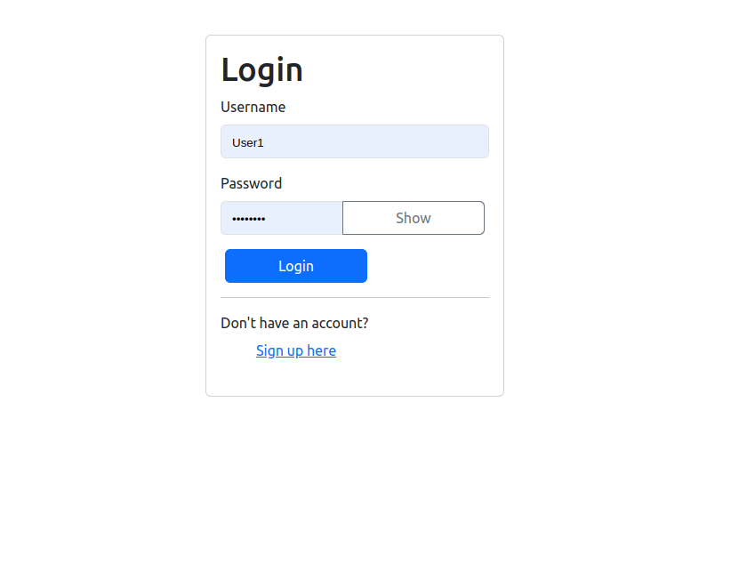
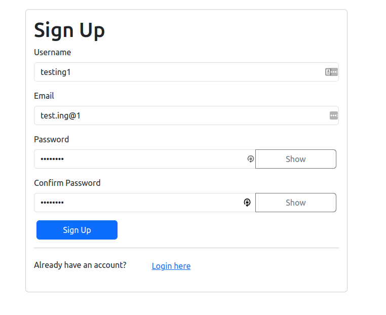
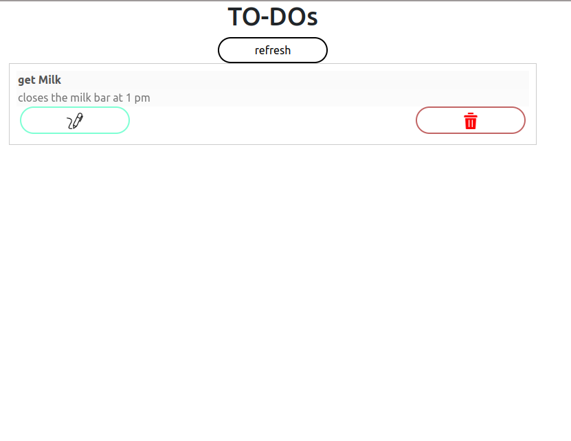
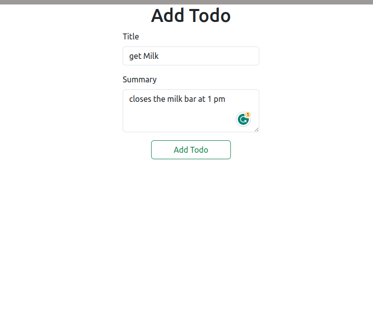
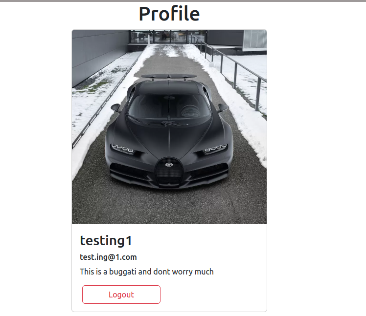

# To-Do frontend

<a href="https://todo-front-peach-kappa.vercel.app/" style="background-color: #4CAF50; color: white; padding: 10px 20px; border: none; border-radius: 4px; cursor: pointer;">Live-link</a>

- Link to  the backend [Back-end](https://github.com/stephen-nene/todo)

# screenshots

1. login-page

   

2. sign-page

   

3. Home page

   

4. add-todo page

   

5. profile-page

     

# Technologies used

       

      

  

  # Contributor
  
  -  **[stevo-nene](https://github.com/stephen-nene)**

# license
- MIT License

--------
## Copyright
 - **NeneCorp** **&copy; 2023**
---------
